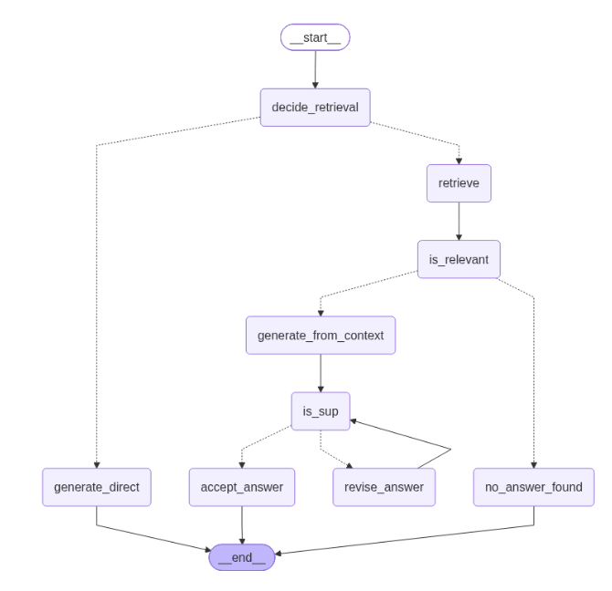

# NexaTech Self-Reflective RAG System

Welcome to the **NexaTech Self-Reflective RAG System** repository. This project implements a production-grade, fault-tolerant Retrieval-Augmented Generation (RAG) pipeline designed for corporate policy, product, and profile analysis. By integrating multi-step validation loops, dynamic retrieval routing, and strict grounding verification, the system eliminates hallucinations and ensures reliable answers sourced directly from enterprise documentation.

---

## 1. Classic RAG Limitations

Traditional (Classic) RAG pipelines follow a rigid, linear sequence: ingest documents, split into chunks, embed via a vector model, retrieve top-$k$ documents for every user query, and pass them directly to an LLM for generation. While effective for simple Q&A, Classic RAG suffers from severe architectural bottlenecks in production environments:

* **Blind Retrieval Overhead:** Classic RAG forces retrieval even for general knowledge or conversational queries (e.g., greetings, general definitions), wasting time, API compute, and introducing noise when documents are unnecessary.
* **Irrelevant Context Pollution:** Vector similarity search ($k=4$) frequently retrieves semantically related chunks that do not actually contain the answer. Passing noisy or irrelevant context degrades answer quality and increases hallucination risks.
* **Lack of Grounding Verification:** Standard RAG pipelines do not verify whether the generated response is strictly supported by the retrieved context, allowing the LLM to inject external assumptions, unsupported adjectives, or outright fabrications[cite: 2].
* **No Self-Correction Mechanism:** If an initial generation is partially supported or inaccurate, a classic pipeline has no feedback loop or retry mechanism to revise, refine, or fallback gracefully[cite: 2].

---

## 2. Self-Reflective RAG Features

To overcome classic limitations, this project implements a **Self-Reflective RAG** workflow managed via **LangGraph**[cite: 2]. The architecture introduces stateful decision nodes, topic-level relevance filtering, rigorous grounding checks (`IsSUP`), and automated self-correction loops[cite: 2].

### Key Features & Workflow Nodes:
* **Dynamic Retrieval Decision (`decide_retrieval`):** Evaluates incoming queries using structured LLM output (`should_retrieve` boolean). Bypasses vector retrieval for general explanations or conversational queries to optimize performance[cite: 2].
* **Topic-Level Document Relevance Filtering (`is_relevant`):** Inspects retrieved chunks individually against the user query at a topic level. Discards irrelevant chunks before generation, preventing context pollution[cite: 2].
* **Direct General Generation (`generate_direct`):** Handles queries requiring no internal document lookup securely using base LLM capabilities with strict fallback constraints[cite: 2].
* **Grounded Generation & Context Synthesis (`generate_from_context`):** Combines verified relevant document chunks into a clean context block to synthesize precise business answers without mentioning internal context mechanics[cite: 2].
* **Strict Grounding Verification (`is_sup`):** Evaluates the generated answer against the context across three distinct support levels (`fully_supported`, `partially_supported`, `no_support`). Disallows unauthorized qualitative or interpretive phrasing (e.g., unverified adjectives like "generous", "robust", "culture")[cite: 2].
* **Iterative Self-Correction & Revision (`revise_answer`):** If an answer is `partially_supported` or `no_support`, the system triggers an automatic revision loop (up to $\text{MAX\_RETRIES} = 5$) enforcing strict quote-only extraction from the source context[cite: 2].
* **Usefulness & Quality Judgment (`is_use`):** Evaluates whether the finalized response actually addresses the user's intent, routing to fallback handlers if answers are off-topic or unhelpful[cite: 2].

---

## 3. Technology Stack

The system is built using an industry-leading stack for high-performance machine learning and agentic workflows:

* **Orchestration & Workflow:** LangGraph (`StateGraph`, state management, conditional routing) & LangChain Core[cite: 2].
* **LLM & Inference:** ChatGroq running high-speed open models (`openai/gpt-oss-120b`) with temperature set to `0` for deterministic outputs[cite: 2].
* **Embeddings:** `BAAI/bge-small-en-v1.5` (Running locally, high-performance, cost-free embedding model)[cite: 2].
* **Vector Store:** FAISS (Facebook AI Similarity Search) configured with $k=4$ retrieval[cite: 2].
* **Structured Outputs:** Pydantic (`BaseModel`, `Field`) for robust JSON schema validation across all agent decisions[cite: 2].
* **Document Parsing & Chunking:** LangChain Community PDF Loaders (`NexaTech — Company Policies.pdf`, `Company Profile.pdf`, `Products and Pricing.pdf`) & `RecursiveCharacterTextSplitter` ($\text{chunk\_size}=600$, $\text{chunk\_overlap}=150$)[cite: 2].

---

## 4. Workflow Graph

The diagram below illustrates the complete state machine and conditional routing logic executed during a user query cycle:

